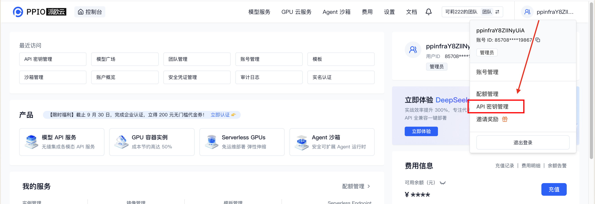

# 介绍

PPIO 提供先进的 AI 大模型推理服务，让用户轻松部署和运行复杂的 AI 任务。我们的平台支持多模态 AI 模型，包括 LLM、图像、音频和视频处理，并整合了最新的领先模型，如 DeepSeek、Qwen、GLM 等。开发者可以轻松利用最先进的 AI 能力，无需深入了解机器学习。

# Configuration

1. 安装插件后，访问 [Settings] 页面输入您的 API Key。 

2. [创建 PPIO 账户](https://ppio.com/user/register?invited_by=JXATT3&utm_source=github_dify)
3. 创建并保存您的 API key [here](https://ppio.com/settings/key-management).
   - 点击您的 [用户头像] → [API Key Management] 访问控制台。
     
   - 点击 **创建** 生成新的 API Key。自定义名称，并注意该密钥 **在生成后只会显示一次** — 确保复制并安全保存以确保未来可以持续使用。
     

# 主要功能
- **30+ 领先的开源模型**: 访问一系列顶尖的开源模型，针对多样化的任务和行业量身定制。
- **专有推理加速**: 通过我们自主优化的推理引擎，提升性能，确保高吞吐量和低延迟。
- **开发者友好集成**: 轻松将 AI 集成到您的流程中，只需简单的 API 调用和最少的设置。
- **成本效益的 AI 解决方案**: 享受无与伦比的性价比，灵活的 [定价](https://ppio.com/pricing?utm_source=github_dify) 模型设计用于可扩展性和效率。

插件的源代码: [https://github.com/cnJasonZ/dify-plugin-ppio](https://github.com/cnJasonZ/dify-plugin-ppio)

# Introduction

PPIO delivers cutting-edge AI large model inference services, empowering users to deploy and run complex AI tasks with ease. Our platform supports multimodal AI models, including LLMs, image, audio, and video processing, and integrates the latest leading models like DeepSeek, Qwen, Llama, and more. Developers can effortlessly leverage state-of-the-art AI capabilities without requiring deep expertise in machine learning.

# Configuration

1. After installing the plugin, access the [Settings] page to enter your API Key. 

2. [Create a PPIO account.](https://ppio.com/user/register?invited_by=JXATT3&utm_source=github_dify)
3. Create and save your API key [here](https://ppio.com/settings/key-management).
   - Click your [User Avatar] → [API Key Management] to access the console.
     
   - Select **[+ Create]** to generate a new API Key. Customize a name, and note that the key **will only be displayed once upon generation** — ensure to copy and save it securely for uninterrupted future use.
     

# Key Features
- **30+ Leading Open-Source Models**: Access a comprehensive suite of top-tier open-source models tailored for diverse tasks and industries.
- **Proprietary Inference Acceleration**: Boost performance with our in-house optimized inference engine, ensuring high throughput and low latency.
- **Developer-Friendly Integration**: Seamlessly integrate AI into your workflows with simple API calls and minimal setup.
- **Cost-Effective AI Solutions**: Enjoy unmatched affordability with flexible [pricing](https://ppio.com/pricing?utm_source=github_dify) models designed for scalability and efficiency.

Source code of this plugin: [https://github.com/cnJasonZ/dify-plugin-ppio](https://github.com/cnJasonZ/dify-plugin-ppio)
